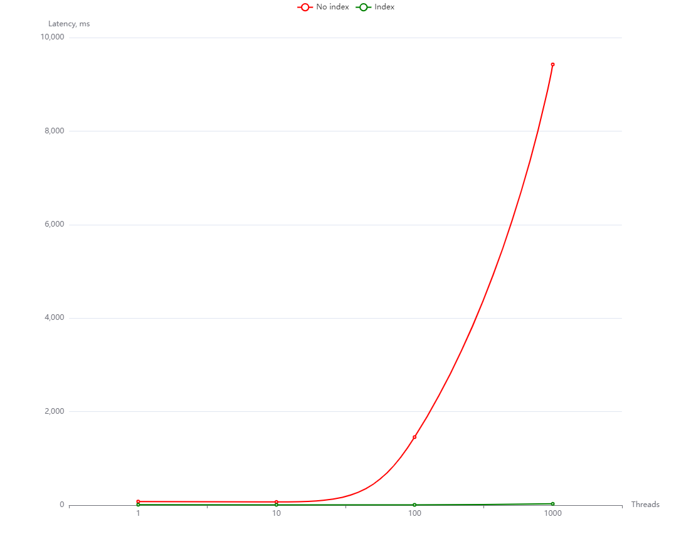
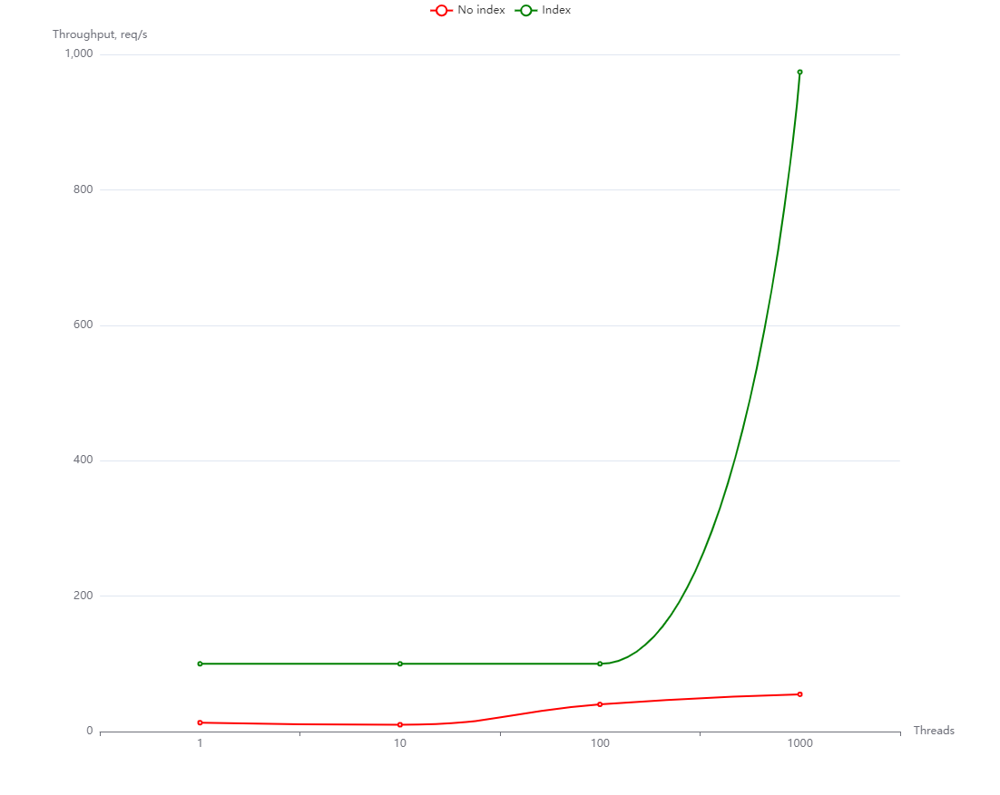

# Report on `user/search` endpoint optimization

## Median latency, ms

| Threads  | 1  | 10 | 100  | 1000 |
|----------|----|----|------|------|
| No index | 77 | 69 | 1455 | 9426 |
| Index    | 10 | 8  | 7    | 29   |



## Throughput, requests per second

| Threads  | 1   | 10  | 100 | 1000 |
|----------|-----|-----|-----|------|
| No index | 13  | 10  | 40  | 55   |
| Index    | 100 | 100 | 100 | 974  |



## Index

### Code

```sql
CREATE EXTENSION IF NOT EXISTS pg_trgm;

CREATE INDEX IF NOT EXISTS idx_account_info_second_name_first_name ON account_info USING GIN(second_name, first_name);
```

### Explain

```
 Bitmap Heap Scan on public.account_info  (cost=115.75..1288.63 rows=336 width=71) (actual time=3.256..3.695 rows=340 lo
ops=1)
   Output: id, account_id, first_name, second_name, biography, city, birthdate
   Recheck Cond: (((account_info.second_name)::text ~~ 'Поп%'::text) AND ((account_info.first_name)::text ~~ 'Арт%'::tex
t))
   Heap Blocks: exact=338
   Buffers: shared hit=477
   ->  Bitmap Index Scan on idx_account_info_second_name_first_name  (cost=0.00..115.67 rows=336 width=0) (actual time=3
.221..3.222 rows=340 loops=1)
         Index Cond: (((account_info.second_name)::text ~~ 'Поп%'::text) AND ((account_info.first_name)::text ~~ 'Арт%':
:text))
         Buffers: shared hit=139
 Planning:
   Buffers: shared hit=39
 Planning Time: 0.283 ms
 Execution Time: 3.731 ms
```

### Reasoning

- Using `GIN` instead if default `BTREE` because with `BTREE` the optimizer still prefers to use sequential scan and not the index.
- `GIN` is generally good for full text search and this for prefix search as well.
- `(second_name, first_name)` instead of `(first_name, second_name)` because second names are more variable than first names, so searching second names first is usually more efficient.
